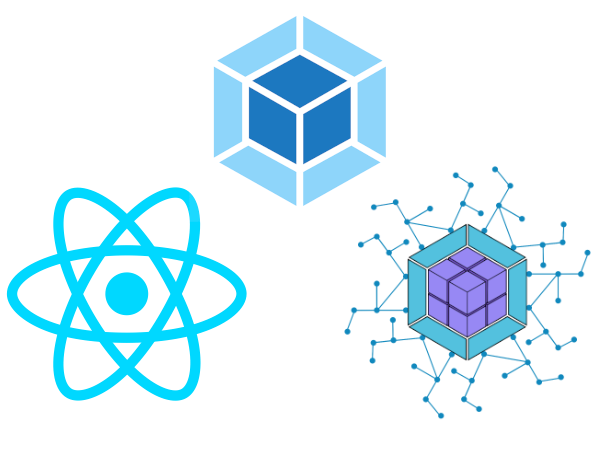
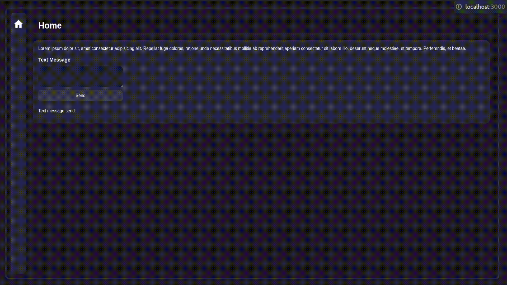

  

<h1 align="center">MicroFrontend POC</h1> 

 <a href="#-about">About</a> •
 <a href="#-tools">Tools</a> •
 <a href="#-settings">Settings</a> • 
 <a href="#-how-to-run">How to run</a> • 
 <a href="#-recommendations-and-explanations">
Recommendations and Explanations</a> • 
<a href="#user-content--license">License</a>

---

## About
It is an application that was developed for the purpose of studying the architecture of micro-frontends, in it I used the webpack and module federation to handle the mfe's 

---

## Tools
The following tools were used in building the project:
- React
- Typescript
- Webpack & Module Federation
- Javascript
- Redux & Redux Toolkit
- Styled Component
- Workspaces

---

## Settings

The project has settings with ambient modes.
> Ex.: Development, Staging, Production.

The environment settings are already added to the project, so to make it work, just install the dependencies in the project root and run.

The project will use the ports:
`3000 & 3001 & 3002`

### Projects

**Shell** -
Shell / Host / Container / Consumer.

These are the most common names you will find, they all have the same purpose, which is to encompass the other projects.

**Mfe1** - Share a page with some cards.

**Mfe2** - If you use a redux state triggered directly from the Shell, managing to share the application state, it could also be done with **ContextApi**, adding the shell instance to the remote itself and changing the absolute path to the module- federation.

> Ex.: import { AuthProvider, useAuth } from '~/hooks/auth'

**To**

> Ex.: import { AuthProvider, useAuth } from 'shell/hooks/auth'

It must be done for both.

---

## How to run
**Just do the following steps...**

- Just install the dependencies in the project root using:
> `yarn install `

Don't worry, workspaces will do all the work of installing the dependencies for each project.

- Run the project:
> `yarn dev `

When executed, it will open 3 instances of Webpack DevServer, one for each project.

---

## Recommendations and Explanations

The project is using the mono-repo architecture only for ease of understanding.

However, if you need to create a similar architecture, the ideal is to run each project separately, and not couple items from one mfe to another, because if one mfe goes offline, the other one that is using it as a dependency will be off until the other becomes to come online again.

This is because project x uses project y as a dependency, so when the module is not found, an error occurs and it stops working.

There are several ways to deal with this problem, but the idea is not to segregate value from one to another.

> Ex.: [Error Boundaries](https://pt-br.reactjs.org/docs/error-boundaries.html), Mock of the component and etc...

Most used is Error Boundaries.

---

## Preview

---

## License

This project is under license [MIT](./LICENSE).

Made with ❤️ by Alan Neres👋🏽 [Contact me!](https://www.linkedin.com/in/alan-neres/)

---

## Language
[🇧🇷 Portuguese | pt-BR](./README.md)
